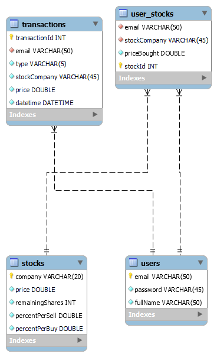

The database portion of this project is used to manage all data related to the application. Using a database allows us to forgo the use of mutexes that we would need if we had used files to manage data instead, since our servers can handle concurrent requests.

The database "stockmarket" can be modeled in an entity relationship diagram as follows.

In details, these entities are:
## stocks
Every entry in this table represents a company, and has the following attributes

- __<ins>company</ins>__: PK; VARCHAR(20); represents the name of the company, e.g. "SIE"
- __price__: DOUBLE; represents current price of stock from company, e.g. 109.98
- __remainingShares__: INT; represents number of remaining shares from company, e.g. 119
- __percentPerSell__: DOUBLE; represents the percentage of price decrease when a share of this company is sold, e.g. 1.5
- __percentPerBuy__: DOUBLE; represents the percentage of price increase when a share of this company is bought, e.g. 2.5

---
### users
Every entry in this table represents a user, and has the following attributes

- <ins>email</ins>: PK; VARCHAR(50); represents the email of the user, e.g. "sara_mohamed@aucegypt.edu"
- **password**: VARHCAR(45); represents the password of the user, e.g. "password"
- **fullName**: VARCHAR(50); represents the full name of the user, e.g. "Sara Mohamed"

---
### user_stocks
Every entry in this table represents a single share, and has the following attributes

- <ins>stockId</ins>: PK; INT; represents the unique id of an entry in this table, e.g. 5
- **email**: FK referencing "users"; VARCHAR(50); represents the owner of the share, e.g. "sara_mohamed@aucegypt.edu"
- **stockCompany**: FK referencing "stocks"; VARCHAR(20); represents the company of the share, e.g. "AAPL"
- **priceBought**: DOUBLE; represents the price at which the share was bought (not relevant to this application), e.g. 145.89

---
### transactions
Every entry in this table represents a single transaction, and has the following attributes

- <ins>transactionId</ins>: PK; INT; represents the unique id of an entry in this table, e.g. 5
- **email**: FK referencing "users"; VARCHAR(50); represents the user to which the transaction is attributed, e.g. "sara_mohamed@aucegypt.edu"
- **type**: VARCHAR(5); represents the type of transaction, e.g. "buy" or "sell"
- **stockCompany**: FK referencing "stocks"; VARCHAR(20); represents the company of the share, e.g. "AAPL"
- **price**: DOUBLE; represents the price of the share at the time of transaction, e.g. 1876.4
- **datetime**: DATETIME; represents the time and date the transaction took place, e.g. "2024-02-06 12:13:11"

