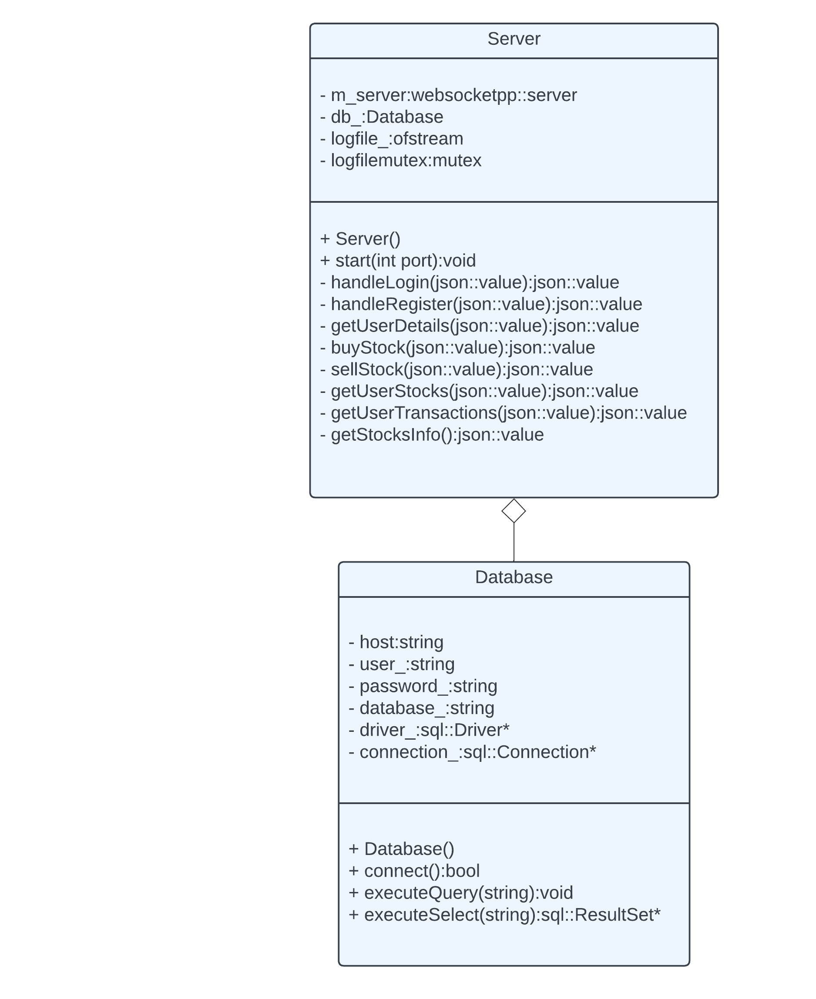

The server component of this project consists of a server that communicates with the frontend by means of a websocket, and with the stock service by means of REST API's. The server also has direct communication with the database as it is in charge of user authorization. It is implemented in C++, and is modeled as a class, the diagram of which is outlined below.




Since messages can be sent between the frontend and the server as strings, all messages are handled as JSON objects. When the frontend wants to fetch all the available stocks for example, it creates an object:

```
{
	"fun": "getallstocks",
	"data": {}
}
```

It then stringifies this JSON and sends it through the websocket to the server. The server retrieves the string, and then parses it pack into a JSON object. It checks the "fun" attribute to check which function is being called for, and executes the corresponding behaviour. Then, it creates another JSON object, for example:

```
{
	"fun": "getallstocks",
	"status": "success",
	"message": "Stocks info found!"
	"data": {
		"stocks": [
			{
				"company": "FB",
				"price": 176.45,
				"remainingShares": 45
			},
			{
				"company": "MSFT",
				"price: 165.43,
				"remainingShares": 444
			}
		]
	}
}
```

and then serializes it to turn it into a string, to send it back to the client to render to the user.

The server also logs any messages it receives and sends, along with the timestamp, in a file names "server.log". This file is protected in the class implementation from concurrency conflicts using a mutex data object in the class, which is locked and unlocked when a log is written to the file.