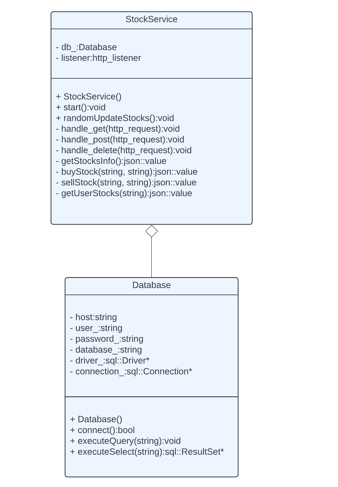

The stock service component of the project consists of a server implemented in C++ that hosts REST API endpoints and accepts calls to those endpoints. The stock provider is in charge of managing stock information by communicating with the database, and automatically updating stock information periodically (every 10 seconds). It initializes data on the stocks using a JSON file at the beginning of the program. Feel free to play around with this file as you please, but keep its structure the same.

An outline of the class diagram of the stock service component is shown below.



The stock service hosts endpoints, and so the server communicates with it by calling these endpoints. In the case of a GET, for example, it will send data in the form of a query parameter. In the case of a POST, it will send a JSON body with the request. For example, when the server sends a post request to buy stock, it sends

```
{
	"email": %% user's email  %%
	"company": %% company name  %%
}
```

as it calls the endpoint for buying stock. The stock service, as is routine for REST APIs, sends a response in the form of 

```
{
	"message": "bought stock successfully!"
}
```

with the corresponding code (200 for success in this case).