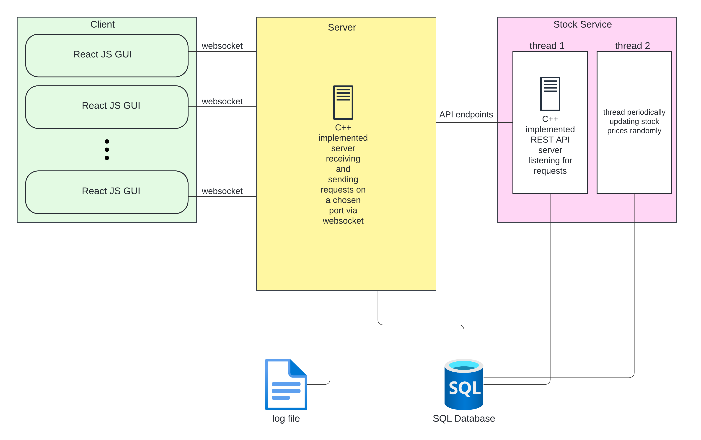

This is the main read me for the stock market application. This application revolves around three main components - a client GUI implemented using React JS, a server communicating with the client using TCP ports (websocket) implemented using C++, and a stock manager that interacts with the server using REST APIs, also implemented using C++.

Reading the documentation files in the "docs" directory is *highly recommended* to get a good understanding of the system before diving in. Class diagrams for separate components are available in their respective documentation files, and a full system architecture diagram is modeled as follows



---
# Features

The project allows clients to sign up and log in to their accounts. They can then view, buy, and sell stocks- all with real-time updating data and graph visualizations. Users can also view their past transactions.

### Client
The client provides a sleek, easy-on- the-eyes GUI for the user to interact with. The client connects to the server by means of a websocket, thus using TCP sockets, to fetch and send all data. By means of authorization and websocket contexts, it can maintain understanding of authorization status throughout all its pages, and connect to the backend from anywhere. Authorization is maintained in the form of a token containing the email of the logged in user (for simplicity). Note that in real-life systems, a JWT authorization token would more likely be adopted, hashing the user’s data for more security.

### Server
The server connects to the database, and communicates with both the client (using websocket) and the stock service (using REST APIs). It does both by using JSON objects, for uniformity. Since websocket send messages through strings or bytes, the communication between server and client occurs by parsing strings into JSON objects upon receiving a message and stringifying JSON objects into strings for sending messages. This maintains uniformity and allows ease of managing different requests.

### Stock Service
The stock service hosts endpoints for the server to connect to via HTTP requests. It connects to a database, and manages both the receiving of requests, as well as randomly updates stock prices in the database every ten seconds, within a margin of +/-10% for each company. It does so through the use of two threads, one listening for requests while the other periodically updates prices. 

### Database
For higher efficiency and easier management, data is stored throughout this application in a MySQL database hosted online. Both the server and the stock manager connect to this database, the former for authentication and registration purposes, and the latter for stock data management purposes. 

The diagrams for all these components are included in the "docs" folder in this directory.

---
# Conventions and File Organization

The project is split into three components. As such, naming conventions follow the framework or language in context. For example, react components are Pascal cases, and HTML class and if names are kebab cased. Similarly, private data member of C++ classes have trailing underscores, etc.

The project contains three folders- “client”, “server”, and “stock-manager”. Each contains the contents of its namesake. Conventions used for receiving and sending messages between components are outlined in the other documents for this project, in a folder named "docs".

---
# How to Run

The project uses an SQL database to manage its data. To start running the program, you need to set up a mySQL server on the localhost of your device, on port 3306. Give this server a user with username "root" and password "password". Then, import the dump files from the "dumps" directory to create the "stockmarket" database on your server.

To run the project without compilation, you need to have npm installed. You can do so by running `sudo apt install npm` in any terminal on your computer. Note these directions apply for Linux-based systems. 

First `cd` into the project directory.  

1. In one terminal run 
```
cd stock-service
./stock-service.out
``` 
   You should see “Connected to database” in the terminal.

2. In a second terminal, run 
```
cd server
./server.out
```
   You should see “Connected to database” in this terminal as well.

3. In a third terminal, run 
```
cd client
npm i —legacy-peer-deps
```
   After your installations have completed, run 
```
npm start
```
   Your client application should start in a browser window on port 3000. 
   
---
# How to Compile

The project uses an SQL database to manage its data. To start running the program, you need to set up a mySQL server on the localhost of your device, on port 3306. Give this server a user with username "root" and password "password". Then, import the dump files from the "dumps" directory to create the "stockmarket" database on your server.

In case you would like to compile the project, you will need several dependencies. These are
- npm
- build-essential (for g++)
- cpprest
- websocketpp
- libssl-dev
- libcrypto++-dev
- libmysqlclient-dev
- libmysqlcppconn-dev

To install these dependencies, in any terminal on your device, run 
```
 sudo apt-get install build-essential
 sudo apt install npm
 sudo apt-get install libcpprest-dev 
 git clone https://github.com/zaphoyd/websocketpp
 sudo apt-get install libmysqlcppconn-dev
 sudo apt-get install libmysqlclient-dev
 sudo apt-get install libssl-dev
 sudo apt-get install libcrypto++-dev
```

 `cd` into the project directory.
1. In one terminal run 
 ```
cd stock-service
g++ -Wall -I/usr/include/cppconn main.cpp -lcpprest -lssl -lcrypto -L/usr/lib -lmysqlcppconn -o stock-service
```
   This compiles your stock service component into an executable file named “stock-service”. To run this file, run `./stock-service`. You should see “Connected to database” in the terminal.
   
2. In a second terminal, run 
 ```
cd server
g++ -Wall -I/usr/include/cppconn main.cpp -lcpprest -lssl -lcrypto -L/usr/lib -lmysqlcppconn -o server
```
   This compiles your  server component into an executable file named “server”. To run this file, run `./server`. You should see “Connected to database” in this terminal as well.
   
3. In a third terminal, run 
```
cd client
npm i —legacy-peer-deps
```
   After your installations have completed, run `npm start`. Your client application should start in a browser window on port 3000.
